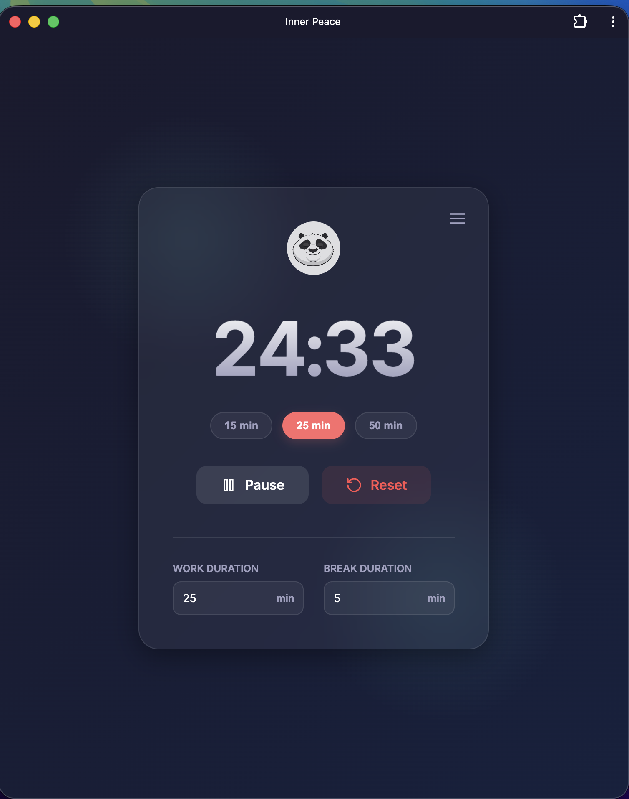
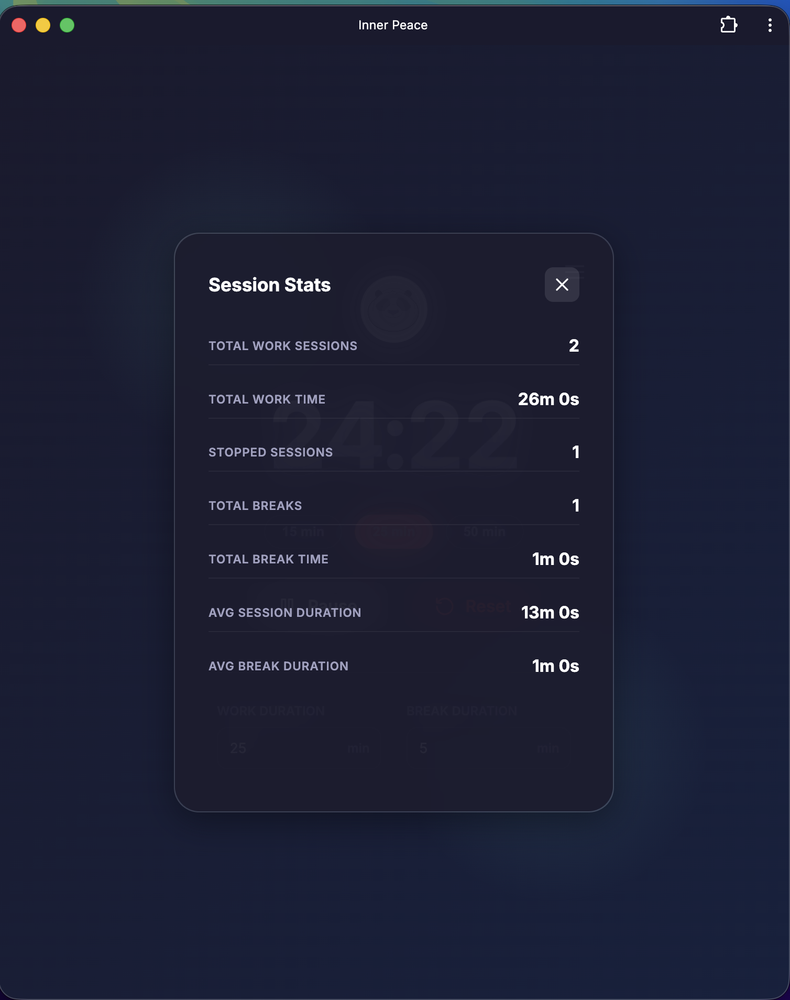

<p align="center">
  
</p>

# Inner Peace

A minimal Pomodoro timer. Installable as a standalone Chrome app (PWA).

<p>
  
  &nbsp;&nbsp;&nbsp;
  
</p>

## Prerequisites

Python 3

## Run

```
make serve
```

Optionally set a custom port:

```
make serve PORT=8080
```

Then open http://localhost:3000 (or your custom port) in Chrome.

## Install as App

1. Run `make serve`
2. Open http://localhost:3000 in Chrome
3. Click the install icon (⊕) in the address bar
4. The app opens in its own window and appears in your Dock/Launchpad
5. After installation, you don't need to start the server, the service worker takes of things
6. Stats are stored in the browser `localStorage()` clearing browser data will reset the stats
